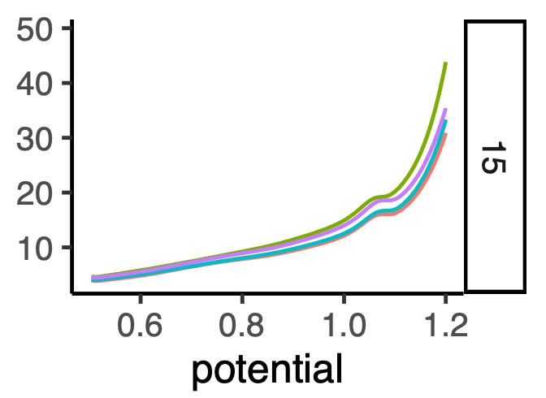
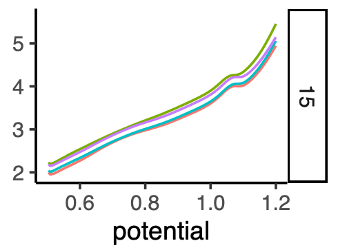
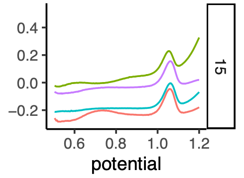
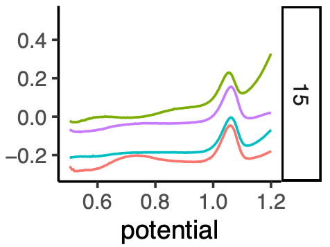
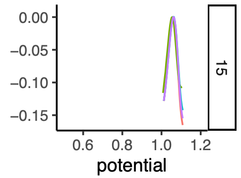
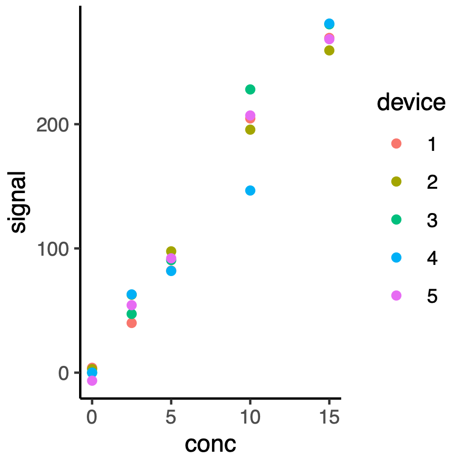
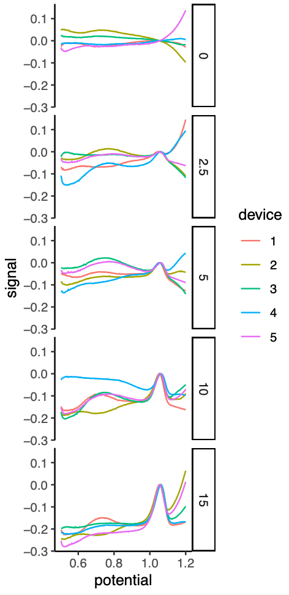

# What does this package do?

The `ldnh` package processes square-wave voltammetry data (i.e.,
"voltammograms") to produce, for each voltammgram, a value measuring the
magnitude of the analyte peak in the voltammogram (i.e., the "signal"
value). The package reads in the voltammogram data via an Excel spreadsheet and
saves the results in two Excel spreadsheets and in two PDF plot files. The
`ldnh` package is named for LDNH, an acronym for the four-step analysis method
that the package implements: *Log-transform*, *De-tilt*, *Normalize*, and
*Hessian* estimation of the signal.

# How exactly does the LDNH method work?

With our electrochemistry setup, a collection of replicate square-wave
voltammograms (at a relatively high analyte concentration level) shows
exponentially increasing absolute current, like this:

**Figure 1:**



Note that the vertical axis title is negative current; the LDNH software expects
current values to be negative, but we plot `-current` here so that the
voltammogram ordinant is overall increasing with increasing potential.  Also,
note that the "15" on the right-hand side of the plot is a facet label
indicating that the concentration of the analyte for this set of voltammograms
is 15 in some concentration units (the specific units do not matter for the
purpose of describing the LDNH method).

The fact that the negative-current voltammogram appears to be (roughly)
exponentially increasing suggests that we may get a more linear-looking
voltammogram if we take the logarithm of `-current`, and indeed, that is the 
case:

**Figure 2:**



The linear behavior, while (from a data analysis convenience standpoint) an
improvement over exponential curves, is still not ideal. We would like to remove
the linear tilt to the data, so that we are attempting to quantify the magnitude
of a relatively unskewed "peak". In order to "detilt" the data, we fit a linear
model to the voltammogram for potential levels to the left of the peak (by
default, between 0.5 and 0.9 V, selected by the user based on the analyte and
the biofluid sample and the electrochemistry setup), and compute the
log-voltammogram's residuals from that linear fit, like this:

**Figure 3:**


We can now use a peak-finding algorithm to find the peak, and to adjust the voltammograms
so that the peaks are at the same signal level (this step is not necessary for signal
extraction via the Hessian method but it makes the replicate variance in the voltammograms
easier to visualize).

**Figure 4:**


The LDNH script saves a PDF plot like the above plot (but with a separate plot panel
for each analyte concentration level in the dataset), as one of its two output plots,
with the filename suffix `-voltammograms-log-detilted-norm.pdf`.

The next step of the LDNH procedure is to obtain the normalized voltammogram
data within a window (selected by the user based on the specific analyte and
biofluid, but whose precise endpoints do not need to be fine-tuned for each
experiment; the default window edges used for the LDNH code are 1.0 to 1.1 V):

**Figure 5:**


The next step of the LDNH procedure is to numerically compute the curvature at
the peak (i.e., the Hessian, or equivalently, the curvature at the *local
maximum,* which is determined numerically using polynomial-smoothed spline
interpolation; the Hessian is computed using numerical estimation on a
spline-interpolated curve) in each of the normalized, windowed
voltammograms. For samples that no local maximum (typically, samples at zero
analyte concentration or at analyte concentration below the limit-of-detection
for the electrochemical assay), the LDNH procedure is to use the average
potential level at the peak (which we'll call *Vavg* here), for all the samples
for which a peak *could* be detected, and to numerically compute the second
derivative at the potential value *Vavg* for those samples for which a peak
could not be detected. The negative of the Hessian is used as the "signal",
resulting in a signal level for each voltammogram, which can be visualized as a
calibration dot-plot with the sample's labeled (known) analyte concentration as
the abscissa:

**Figure 6:**


The LDNH script saves a PDF plot like this dot plot, as one of its two output plots,
with the filename suffix `-dot-plot.pdf`.

# Requirements

You will need the R Statistical Computing software ("R") in order to use the
`ldnh` software package. You can get R for free at the
[CRAN website](https://cran.r-project.org/). In theory, the `ldnh` software
package should work whether your R installed on Mac, Windows, or Linux; but to
date, we have only tested `ldnh` on macOS 12.4.

# Installing Rstudio

If you do not have Rstudio installed, you might want to install it in order to
make it easier to use the `ldnh` software; Rstudio provides an Integrated
Development Environment (IDE) for using R. You can get Rstudio for free at the
[Rstudio website](https://www.rstudio.com/products/rstudio/download/).

Rstudio is not required in order to use the `ldnh` R package.

# Installing the `ldnh` package into R

To install this R package, run Rstudio (or start an R session) and then follow
these steps, in order:

1. Install the R package `remotes` from CRAN by running the following command in the Rstudio console:

```
install.packages("remotes")
```

2. Install the R package `ldnh` from GitHub by running the following command in the R Console:

```
options(install.packages.compile.from.source = "never")
remotes::install_github("ramseylab/ldnh")
```

You may be asked "These packages have more recent versions
available; which would you like to update?"; in that case,
respond `3` (corresponding to "None").

3. If you have updated the `ldnh` package (versus installing it for the first time),
you should quit and restart R; otherwise, just proceed to the section "Running the
`ldnh` software to process voltammograms" below.

### Notes

- Once you have performed Step 1 once, you should not need to perform it again.
- Once you have performed Step 2 once, you should only need to perform it again
unless there is an update to the `ldnh` R package that you want to use within
your local R installation.
- You need to perform Step 3 above, each time you want to process some voltammograms.

# Running the `ldnh` software to process voltammograms

In the R console, run the following command in order to run the analysis script:

```ldnh::process_voltammograms()```

The script is meant to be used interactively. It will prompt you to type in responses
via the console, though in theory it could be automated by using shell redirection to
use a file to supply responses to the prompts.

# Input spreadsheet format:

The script `process_voltammograms` (see Step 3 above) expects to load your voltammogram
data in an Excel spreadsheet (an `.xlsx` file) with the following four columns in it.
The columns do not have to be in any particular order, but their names must be 
*exactly* as shown below:

- `potential`: this column contains the voltage levels (numeric type)
- `current`: this column contains the peak current levels, at each potential level (numeric type)
- `device`: identifies the specific device (i.e., replicate) (integer type)
- `conc`: identifies the concentration of analyte (numeric type)

As you can see from the above, the spreadsheet is required to have the data
arranged in a "melted" format of four-tuples, like this:

| potential | device | conc | current |
| --------- | ------ | ---- | ------- |
| 0.504     | 1      | 0    | \-4.858 |
| 0.508     | 1      | 0    | \-4.758 |
| 0.512     | 1      | 0    | \-4.785 |
| 0.516     | 1      | 0    | \-4.825 |
| 0.520     | 1      | 0    | \-4.880 |
| 0.524     | 1      | 0    | \-4.931 |
| 0.528     | 1      | 0    | \-4.990 |
| 0.532     | 1      | 0    | \-5.040 |
| 0.536     | 1      | 0    | \-5.097 |
| 0.540     | 1      | 0    | \-5.151 |
| 0.544     | 1      | 0    | \-5.206 |
| 0.548     | 1      | 0    | \-5.260 |
| 0.552     | 1      | 0    | \-5.314 |
| 0.556     | 1      | 0    | \-5.367 |
| 0.560     | 1      | 0    | \-5.424 |
| 0.564     | 1      | 0    | \-5.477 |
| 0.568     | 1      | 0    | \-5.539 |
| 0.572     | 1      | 0    | \-5.589 |
| 0.576     | 1      | 0    | \-5.645 |
| 0.580     | 1      | 0    | \-5.707 |
| 0.584     | 1      | 0    | \-5.751 |
| 0.588     | 1      | 0    | \-5.810 |
| 0.592     | 1      | 0    | \-5.873 |
| 0.596     | 1      | 0    | \-5.927 |
| 0.600     | 1      | 0    | \-5.983 |
| 0.604     | 1      | 0    | \-6.044 |
| 0.608     | 1      | 0    | \-6.101 |
| 0.612     | 1      | 0    | \-6.162 |
| 0.616     | 1      | 0    | \-6.228 |
| 0.620     | 1      | 0    | \-6.282 |
| 0.624     | 1      | 0    | \-6.343 |
| 0.628     | 1      | 0    | \-6.407 |
| 0.632     | 1      | 0    | \-6.472 |
| 0.636     | 1      | 0    | \-6.536 |
| 0.640     | 1      | 0    | \-6.598 |
| 0.644     | 1      | 0    | \-6.662 |
| 0.648     | 1      | 0    | \-6.726 |
| 0.652     | 1      | 0    | \-6.794 |

Note: the `process_voltammograms` function assumes that the input voltammogram
current values are *negative* as shown in the input file excerpt above.

# Output files

If your input spreadsheet is named `data-20220712.xlsx`, then the `process_voltammograms`
function will produce four output files:

`data-20220712-dot-plot.pdf`: this is the calibration dot-plot for the data; for an example,
see Figure&nbsp;6.

`data-20220712-voltammograms-log-detilted-norm.pdf`: this is a faceted (multi-panel)
plot of the log-transformed, detilted, and normalized voltammograms, with each
panel corresponding to a different analyte concentration; for example:

**Figure 7:**


`data-20220712-processed.xlsx`: this is a spreadsheet providing the quantitative
data that are shown in the "calibration dot plot"; the `signal` column contains
the signal for each sample, calculated as the negative of the curvature at the peak:

| conc\_factor | device | conc | signal |
| ------------ | ------ | ---- | ------ |
| 0            | 1      | 0    | 3.90   |
| 2.5          | 1      | 2.5  | 39.98  |
| 5            | 1      | 5    | 82.11  |
| 10           | 1      | 10   | 204.66 |
| 15           | 1      | 15   | 269.44 |
| 0            | 2      | 0    | 2.84   |
| 2.5          | 2      | 2.5  | 62.73  |
| 5            | 2      | 5    | 97.66  |
| 10           | 2      | 10   | 195.61 |
| 15           | 2      | 15   | 259.39 |
| 0            | 3      | 0    | 0.00   |
| 2.5          | 3      | 2.5  | 47.25  |
| 5            | 3      | 5    | 90.60  |
| 10           | 3      | 10   | 227.99 |
| 15           | 3      | 15   | 280.43 |
| 0            | 4      | 0    | 0.00   |
| 2.5          | 4      | 2.5  | 62.98  |
| 5            | 4      | 5    | 81.85  |
| 10           | 4      | 10   | 146.60 |
| 15           | 4      | 15   | 280.99 |
| 0            | 5      | 0    | \-6.46 |
| 2.5          | 5      | 2.5  | 54.32  |
| 5            | 5      | 5    | 92.02  |
| 10           | 5      | 10   | 207.02 |
| 15           | 5      | 15   | 268.44 |


`data-20220712-summary.xlsx`: this is a spreadsheet with one row and six
columns providing the overall summative quantitative results including
the Pearson product moment coefficient (i.e., sample correlation coefficient *r*)
of the calibration dot-plot (`r`); the squared correlation coefficient (`r2`);
the slope (`slope`) and intercept (`intercept`) of the calibration dot-plot; 
and the average relative error for predicting analyte concentration from the
extracted signal (using the best-fit calibration line, i.e., the line with the
returned slope and intercept), computed using the L1 norm (`avg_rel_err_l1`)
and L2 norm (`avg_rel_err_l2`), respectively:

| avg\_rel\_err\_l1 | avg\_rel\_err\_l2 | r     | r2    | slope | intercept |
| ----------------- | ----------------- | ----- | ----- | ----- | --------- |
| 0.329             | 0.147             | 0.989 | 0.977 | 0.053 | \-0.029   |

# Why do you use the Hessian at the peak, to obtain the signal?

In Figure 7, notice how the peak widths do not change with increasing analyte
concentration; only the peak heights change. For a peak height to increase with
the width staying the same, the magnitude of the second derivative at the peak
(Hessian, or peak curvature) must also increase. Furthermore, estimating the
instantaneous curvature at the peak *does not require picking a baseline
abscissa from which to compute the peak height*. The lack of a need to choose a
baseline level is a major advantage to the Hessian method, resulting in the
relatively small variation in signal levels for each group of marks (i.e., at
each analyte concentration level) in Figure 6.

